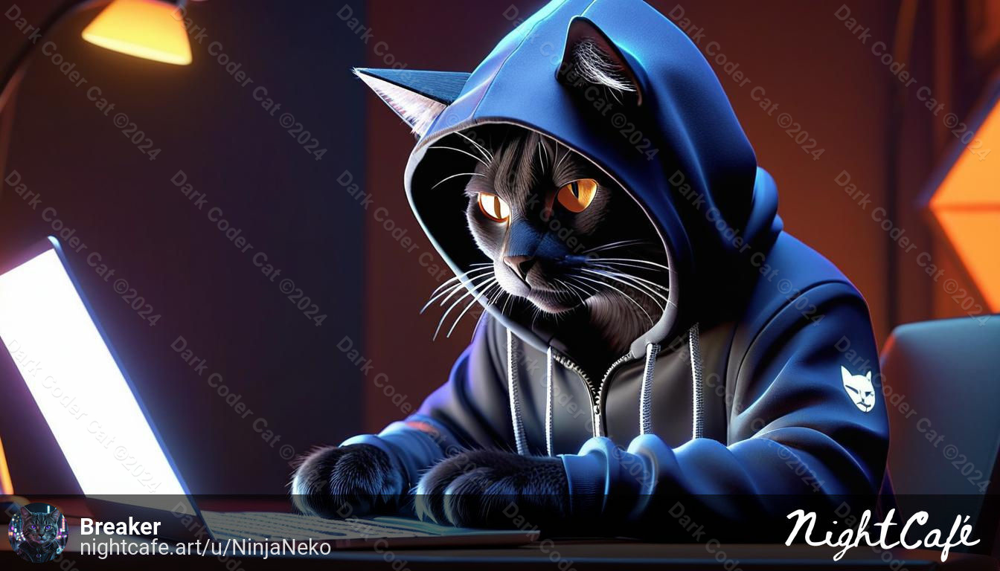

- 👋 Hi, I’m @DarkCoderCat
- 🌱 I’m currently learning Python
- 💻 My favorite distrobution of Linux is Debian
- 🖥️ My favorite games are the Resident Evil Franchise, the Final Fantasy Franchise (up until VIII), The Doom Franchise, Duke Nukem 3D, Mass Effect Franchise (Except Andromeda)
- 🐈‍⬛ I'm just some cat here to learn Python and keep follow of all of the open source apps that he has installed.

- "Anyone who codes and wants to be paid for it, is a fascist" ~Unknown
 

- "Just because you can doesn't mean you should" ~Unknown
 

My Picture 👇👇👇👇 (Special thanks to Breaker O'Day for making me the pic)

<a rel="me" href="https://liberdon.com/@breaker">Mastodon</a>
<!---
DarkCoderCat/DarkCoderCat is a ✨ special ✨ repository because its `README.md` (this file) appears on your GitHub profile.
You can click the Preview link to take a look at your changes.
--->
